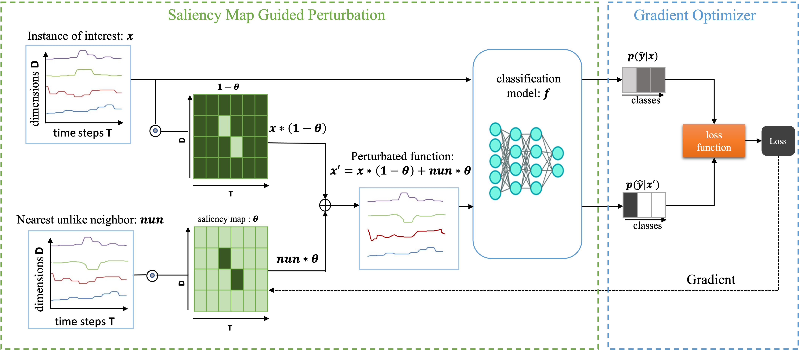

# M-CELS: Counterfactual Explanation for Multivariate Time Series Data Guided by Learned Saliency Maps
This is the repository for our paper titled "M-CELS: Counterfactual Explanation for Multivariate Time Series Data Guided by Learned Saliency Maps". This paper has been accepted at the [23rd IEEE International Conference on Machine Learning and Applications (ICMLA)](https://www.icmla-conference.org/icmla24/). 

# Architecture

# Prerequisites and Instructions
All python packages needed are listed in [pip-requirements.txt](pip-requirements.txt) file and can be installed simply using the pip command.

# Get the results for BasicMotions dataset by running
python3 main0.py --pname MCLES_BasicMotions --task_id 0 --run_mode turing --jobs_per_task 10 --samples_per_task 40 --dataset BasicMotions --algo cf --seed_value 1 --enable_lr_decay False --background_data train --background_data_perc 100 --enable_seed True --max_itr 1000 --run_id 0 --bbm dnn --enable_tvnorm True --enable_budget True --dataset_type test --l_budget_coeff 1.0 --run 1 --l_tv_norm_coeff 1.0 --l_max_coeff 1.0
